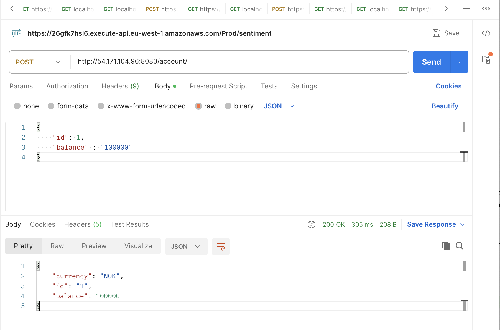
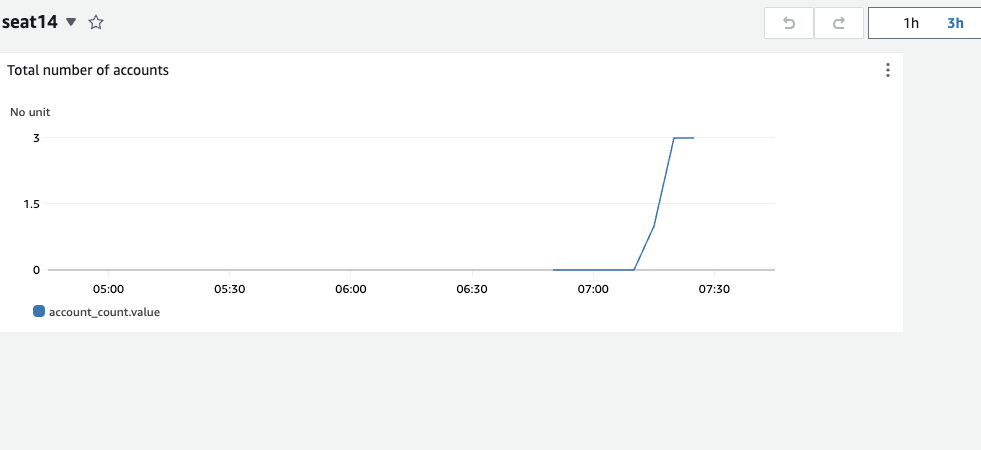

# Business Metrics with Spring Boot og CloudWatch & Terraform

The application in this repository is a "mock" bank application that features various endpoints for common banking transactions.
In this exercise, you will learn how to instrument a Spring Boot application with business metrics. By business metrics, we refer to metrics that do not pertain to the technical performance of the application, but rather to insights into user behavior, such as the amount of money transferred and the number of transactions performed.
This exercise utilizes Java, Spring Boot, and a metrics framework called Micrometer.
We will also explore how to visualize metrics in AWS CloudWatch and how to use Terraform to create a dashboard.

# Prepare your Cloud 9 environment

Log in to your Cloud 9 environment as usual

## Terraform pro tip 

Instead of using the Terraform installation that comes with Cloud9, we can use "tfenv" - a tool that 
allows us to download and use different versions of Terraform. This is very useful to know since you might work in an 
environment with several different projects or teams that use different Terraform versions.

```sh   
git clone https://github.com/tfutils/tfenv.git ~/.tfenv
echo 'export PATH="$HOME/.tfenv/bin:$PATH"' >> ~/.bash_profile
sudo ln -s ~/.tfenv/bin/* /usr/local/bin
```

To see what versions are available 

```sh
tfenv list-remote
```

Let's pick 1.7.4 which is pretty recent - use will also install if the version is not downloaded on your computer.

```sh
tfenv use 1.7.4
```

Set up terraform to use this version 

```sh
tfenv use 1.7.4
terraform --version
```

Check that it worked!

## Install JQ

Jq is a great tool to work with JSON from the command line 

```
sudo yum install jq
```

## Install maven 

Install Maven in Cloud 9. We will try to run the Spring Boot application from Maven in the terminal.

```
sudo wget http://repos.fedorapeople.org/repos/dchen/apache-maven/epel-apache-maven.repo -O /etc/yum.repos.d/epel-apache-maven.repo
sudo sed -i s/\$releasever/6/g /etc/yum.repos.d/epel-apache-maven.repo
sudo yum install -y apache-maven
sudo yum install jq
```

## Use Terraform to Create a CloudWatch Dashboard

* Clone this repo into your Cloud9 environment (Remember to clone with the HTTP URL)
* Look in the "infra" directory - here you will find the file dashboard.tf which contains Terraform code for a CloudWatch Dashboard.
* As you can see, the dashboard is described in a JSON format. Here you can find documentation https://docs.aws.amazon.com/AmazonCloudWatch/latest/APIReference/CloudWatch-Dashboard-Body-Structure.html
Here you also see how one often includes text or code using "Heredoc" syntax in Terraform code, so that we don't have to worry about "newline", "Escaping" of special characters, etc. (https://developer.hashicorp.com/terraform/language/expressions/strings)

```hcl
resource "aws_cloudwatch_dashboard" "main" {
  dashboard_name = var.student_name
  dashboard_body = <<DEATHSTAR
{
  "widgets": [
    {
      "type": "metric",
      "x": 0,
      "y": 0,
      "width": 12,
      "height": 6,
      "properties": {
        "metrics": [
          [
            "${var.student_name}",
            "account_count.value"
          ]
        ],
        "period": 300,
        "stat": "Maximum",
        "region": "eu-west-1",
        "title": "Total number of accounts"
      }
    }
  ]
}
DEATHSTAR
}
```
## Task 

* Run terraform init / plan / apply from your Cloud 9 environment See that a Dashboard is created in CloudWatch
* you have to type in a student name, why?
* Can you think of at least two ways to fix it so that you don't have to type a student name on plan/apply/destroy?


## Look at the Spring Boot application

Oepn *BankAccountController.Java* , You'll find this code

```java
    @Override
    public void onApplicationEvent(ApplicationReadyEvent applicationReadyEvent) {
        Gauge.builder("account_count", theBank,
                b -> b.values().size()).register(meterRegistry);
    }
```

This creates a new metric - of the type Gauge, which constantly reports how many bank accounts exist in the system by 
counting the size of the values in the map holding the accounts. 

## Modify the MetricsConfig Class

You need to modify the MetricsConfig class and use your own name for the cloudwatch namespace

````java
 return new CloudWatchConfig() {
        private Map<String, String> configuration = Map.of(
                "cloudwatch.namespace", "",
                "cloudwatch.step", Duration.ofSeconds(5).toString());
        
        ....
    };
````

Install Maven in Cloud 9. We will try to run the Spring Boot application from Maven in the terminal.

```
sudo wget http://repos.fedorapeople.org/repos/dchen/apache-maven/epel-apache-maven.repo -O /etc/yum.repos.d/epel-apache-maven.repo
sudo sed -i s/\$releasever/6/g /etc/yum.repos.d/epel-apache-maven.repo
sudo yum install -y apache-maven
sudo yum install jq
```

## Start Spring Boot applikasjonen 


_from the root folder_ in your terminal. Start the Spring boot app with maven with
```
mvn spring-boot:run
```

The code in this repository exposes a REST interface at http://localhost:8080/account

## Test the API

Curl is a command-line tool used to transfer data to or from a server, supporting a wide range of protocols 
including HTTP, HTTPS, FTP, and more. It is widely used for testing, sending  requests, and interacting with APIs directly 
from the terminal or in scripts.

If you don't feel like using curl, but would prefer postman or something and run the tests from your local computer; follow these instructions 

Find the Security group (A kind of firewall) protecting your Cloud 9 machine 

```shell
 aws ec2 describe-instances --instance-ids $(curl -s http://169.254.169.254/latest/meta-data/instance-id) --query 'Reservations[*].Instances[*].SecurityGroups[*].GroupId' --output text
```
Open traffic from everywhere on port  8080

```shell
aws ec2 authorize-security-group-ingress --group-id <YOUR SECURITY GROUP ID>  --protocol tcp --port 8080 --cidr 0.0.0.0/0
```

Find the IP address of your computer

```shell
 curl -s http://169.254.169.254/latest/meta-data/public-ipv4
```

You can then use for example postman to access your API 




### Operations 

Create an account with an id and balance 

```sh
curl --location --request POST 'http://localhost:8080/account' \
--header 'Content-Type: application/json' \
--data-raw '{
    "id": 1,
    "balance" : "100000"
}'|jq
```

* See information about an account

```sh 
  curl --location --request GET 'http://localhost:8080/account/1' \
  --header 'Content-Type: application/json'|jq
```

* Transfer money from one account to another 

```sh
curl --location --request POST 'http://localhost:8080/account/2/transfer/3' \
--header 'Content-Type: application/json' \
--data-raw '{
    "fromCountry": "SE",
    "toCountry" : "US",
    "amount" : 500
}
'|jq
```

## Check that we see data in the dashboard

* Go to the AWS UI, and select the CloudWatch service. Choose "Dashboards".
* Search for your own student name and open the dashboard you created.
* See that you get data points on the graph.

It should look something like this:



## Tasks

* Add more Metrics to your code and dashboard.
* Can you create a new endpoint with new functionality?
* Can you create a Gauge that returns the total amount of money in the bank?
* Feel free to use the following guide for inspiration https://www.baeldung.com/micrometer
* Reference implementation; https://micrometer.io/docs/concepts
* Useful links; 

- https://spring.io/blog/2018/03/16/micrometer-spring-boot-2-s-new-application-metrics-collector
- https://docs.spring.io/spring-boot/docs/current/reference/htmlsingle/#production-ready-metrics
